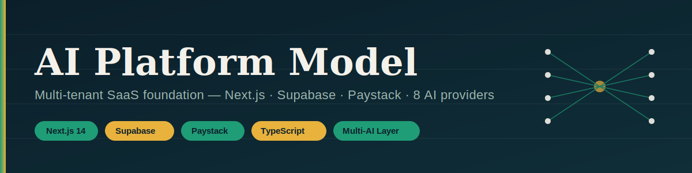
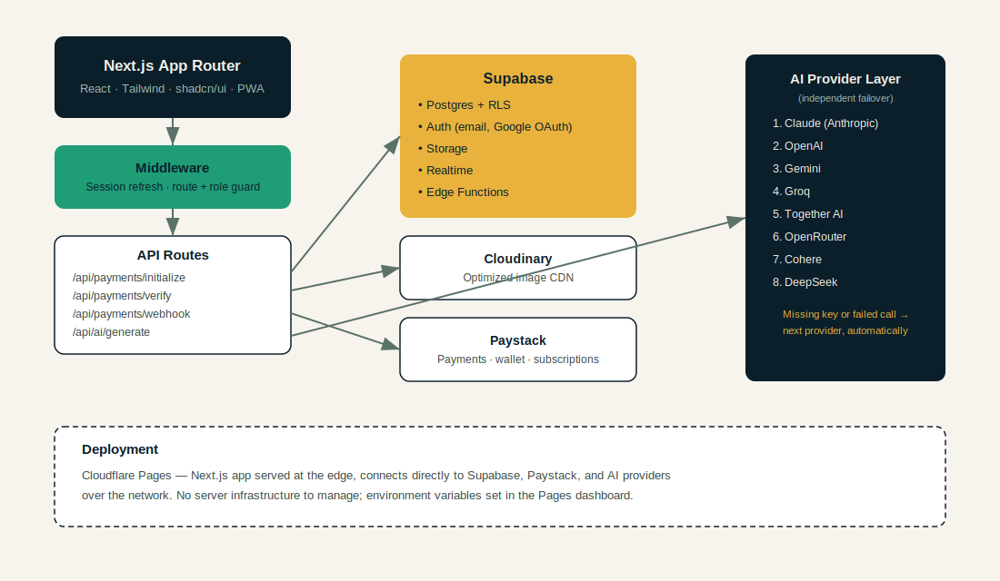

<div align="center">
  

  <h3>A production-ready SaaS foundation — auth, wallet, subscriptions, payments, and an 8-provider AI layer, out of the box.</h3>

  <p>
    
    
    
    
    
    
    
  </p>
</div>

---

## Overview

**AI Platform Model** is a domain-agnostic starter for building SaaS products on a Kenya-friendly, global-ready stack. It ships with the parts every product needs and re-implements badly — authentication, role-based access, a wallet and subscription billing system wired to Paystack, and a resilient multi-provider AI layer — so product work can start on day one instead of week three.

It is a **foundation**, not a finished product: no domain tables are included on purpose. Drop your actual entities (listings, courses, orders, whatever the product is) on top.

## Table of contents

- [Features](#features)
- [Architecture](#architecture)
- [Interface preview](#interface-preview)
- [Tech stack](#tech-stack)
- [Getting started](#getting-started)
- [Environment variables](#environment-variables)
- [Project structure](#project-structure)
- [Database schema](#database-schema)
- [API routes](#api-routes)
- [Deployment — Cloudflare Pages](#deployment--cloudflare-pages)
- [Roadmap](#roadmap)
- [License](#license)

## Features

| Area | What's included |
|---|---|
| **Auth** | Email/password, Google OAuth, password reset, email verification, secure sessions, protected routes, role-based access (`user` / `admin`) |
| **Database** | One clean Postgres migration — constraints, indexes, triggers, views, RLS on every table |
| **Wallet & billing** | Credit wallet with ledger-enforced balances, one-time payments, monthly subscriptions, Paystack webhooks with HMAC verification, automatic feature unlocking |
| **AI layer** | 8 providers (OpenAI, Gemini, Claude, OpenRouter, Groq, Together AI, Cohere, DeepSeek) behind one interface. A missing key or failed call moves to the next provider automatically — one outage never takes down generation |
| **Storage** | Supabase Storage for user files, Cloudinary for optimized image delivery and transforms |
| **Frontend** | Next.js App Router, Tailwind, a small shadcn-style component set, Framer Motion (used for the AI Playground's message transitions), full PWA support via a hand-written, dependency-free service worker |
| **Deployment** | Cloudflare Pages — no server to manage, edge-served, environment variables set once in the dashboard |

## Architecture



**Request flow:** the client hits Next.js middleware first, which refreshes the Supabase session and gates `/dashboard` and `/admin` by auth state and role. API routes then talk to Supabase (Postgres + RLS as the source of truth), Paystack for payment operations, Cloudinary for image delivery, and the AI provider layer for generation — each of those integrations fails independently without taking the others down.

## Interface preview

The full UI is implemented, not mocked: a marketing landing page, a split-screen auth flow, and a dashboard shell with a persistent sidebar (complete with a live "ledger tape" — a scrolling feed of wallet, subscription, and AI events, which is also the landing page's hero visual).

| Surface | What's there |
|---|---|
| **Landing page** (`/`) | Hero with the ledger tape, feature grid, architecture walkthrough, pricing pulled from the seeded plans |
| **Auth** (`/login`, `/register`, `/forgot-password`, `/reset-password`) | Split-screen layout, Google OAuth, email verification state, password reset flow |
| **Dashboard** (`/dashboard`) | Wallet balance, current plan, recent payments and AI calls |
| **Billing** (`/dashboard/billing`) | Wallet top-up dialog (quick amounts + custom), plan comparison with subscribe buttons, full payment history |
| **AI Playground** (`/dashboard/ai-playground`) | Chat-style interface hitting the failover chain directly — pick a specific provider or leave it on auto |
| **Settings** (`/dashboard/settings`) | Profile (name + Cloudinary-backed avatar upload), password change, light/dark theme toggle |
| **Admin** (`/admin`) | Revenue chart, user list with promote/demote, role-gated via middleware + RLS |

Run `npm run dev` and click through it — there's nothing left to imagine.

## Tech stack

```
Frontend    Next.js 16 (App Router) · React 18 · TypeScript · Tailwind CSS · shadcn/ui · Framer Motion · PWA
Backend     Supabase — Postgres · Auth · Row Level Security · Storage · Edge Functions · Realtime
Payments    Paystack — one-time, wallet top-up, subscriptions, webhooks
Media       Cloudinary (image CDN + transforms) + Supabase Storage
AI          OpenAI · Google Gemini · Anthropic Claude · OpenRouter · Groq · Together AI · Cohere · DeepSeek
Deploy      Cloudflare Pages
```

## Getting started

```bash
git clone https://github.com/learninghub44/ai-platform-model.git
cd ai-platform-model
npm install
cp .env.example .env.local   # fill in your keys
```

1. Create a Supabase project.
2. Run `supabase/migrations/0001_init.sql` in the Supabase SQL editor (or `supabase db push` via the CLI).
3. In Supabase → Authentication → Providers, enable Google, and set the site URL / redirect URL to `<your-domain>/auth/callback`.
4. Fill in `.env.local` — Supabase keys, Cloudinary credentials, Paystack keys, and whichever AI provider keys you have. Any AI key left blank is simply skipped; nothing else breaks.
5. `npm run dev`

## Environment variables

See [`.env.example`](.env.example) for the full list. Grouped summary:

| Group | Variables |
|---|---|
| Supabase | `NEXT_PUBLIC_SUPABASE_URL`, `NEXT_PUBLIC_SUPABASE_ANON_KEY`, `SUPABASE_SERVICE_ROLE_KEY` |
| Cloudinary | `CLOUDINARY_CLOUD_NAME`, `CLOUDINARY_API_KEY`, `CLOUDINARY_API_SECRET` |
| Paystack | `PAYSTACK_SECRET_KEY`, `NEXT_PUBLIC_PAYSTACK_PUBLIC_KEY` |
| AI providers | `OPENAI_API_KEY`, `GOOGLE_GEMINI_API_KEY`, `ANTHROPIC_API_KEY`, `OPENROUTER_API_KEY`, `GROQ_API_KEY`, `TOGETHER_API_KEY`, `COHERE_API_KEY`, `DEEPSEEK_API_KEY`, `AI_PROVIDER_PRIORITY` |

## Project structure

```
├── docs/                     banner, architecture diagram, UI mockups
├── supabase/
│   └── migrations/0001_init.sql
├── src/
│   ├── app/
│   │   ├── (auth)/           login, register, forgot-password, reset-password
│   │   ├── (dashboard)/      dashboard, admin
│   │   ├── api/
│   │   │   ├── payments/     initialize, verify, webhook
│   │   │   └── ai/           generate
│   │   └── auth/callback/    OAuth + email-verification exchange
│   ├── components/ui/        shadcn-style Button, Input, Card
│   ├── lib/
│   │   ├── ai/                types, orchestrator, 8 providers
│   │   ├── payments/paystack.ts
│   │   ├── supabase/           client, server, middleware
│   │   └── cloudinary.ts
│   └── middleware.ts
```

## Database schema

One migration (`supabase/migrations/0001_init.sql`) creates everything:

- **`profiles`** — one row per `auth.users`, auto-created on signup via trigger, carries `role` (`user`/`admin`)
- **`wallets`** + **`wallet_transactions`** — balance is derived from the transaction ledger via trigger, never edited directly
- **`subscription_plans`** + **`subscriptions`** — one active subscription per user, enforced with a partial unique index
- **`payments`** — every Paystack transaction, `pending` → `success`/`failed`, linked by `reference`
- **`ai_usage_logs`** — every AI call attempt, successful or not, for observability
- **`files`** — Supabase Storage object metadata, optionally mirrored to Cloudinary
- **Views** — `user_entitlements` (per-user wallet + plan snapshot), `payments_summary` (admin revenue rollup)
- **RLS** — enabled on every table; users see their own rows, an `is_admin()` helper grants admin access

## API routes

| Route | Method | Purpose |
|---|---|---|
| `/api/payments/initialize` | `POST` | Creates a pending payment row, starts a Paystack transaction |
| `/api/payments/verify` | `GET` | Client-side confirmation after redirect back from Paystack |
| `/api/payments/webhook` | `POST` | Source of truth — HMAC-verified Paystack events, unlocks wallet credit / subscription state |
| `/api/ai/generate` | `POST` | Runs the provider failover chain, logs every attempt |

## Deployment — Cloudflare Pages

1. Push this repo to GitHub (already done).
2. In the Cloudflare dashboard: **Workers & Pages → Create → Pages → Connect to Git**, pick `ai-platform-model`.
3. Build settings:
   - Framework preset: **Next.js**
   - Build command: `npm run build`
   - Build output directory: `.next`
   - Add the `@cloudflare/next-on-pages` adapter if you need edge runtime routes (`npx @cloudflare/next-on-pages`), or deploy as-is for standard SSR-compatible routes.
4. Add every variable from `.env.example` under **Settings → Environment variables** (Production and Preview).
5. Set the Paystack webhook URL to `https://<your-pages-domain>/api/payments/webhook`.
6. Trigger a deploy — no code changes required.

## Roadmap

- [ ] Domain-specific product tables (define once the product spec is set)
- [ ] Transactional email beyond Supabase's built-in auth emails
- [ ] Mobile-native drawer nav (currently a lightweight `<details>`-based menu)

## License

[MIT](LICENSE) © Chris Odhiambo
